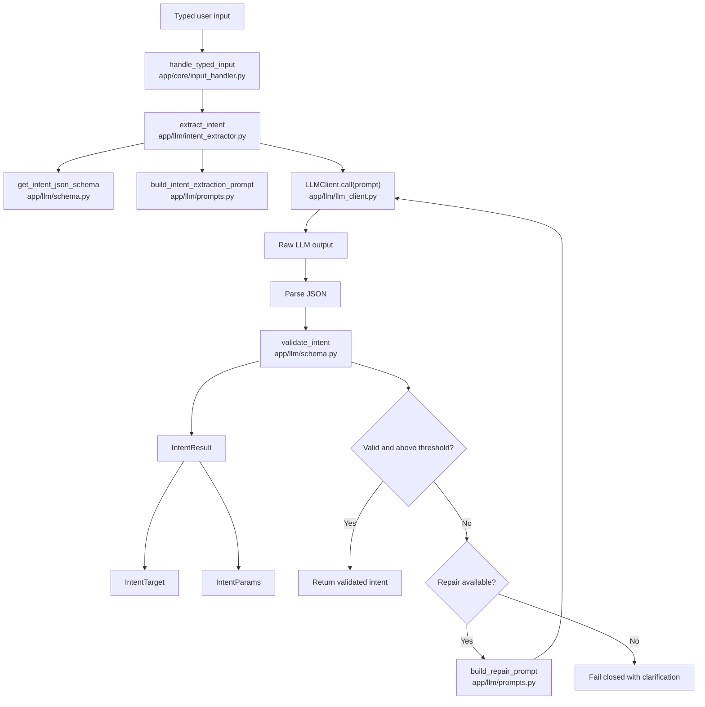

# 🧠🏠 Local LLM Smart Home

A local-first, LLM-powered conversational interface for Home Assistant.

This project replaces brittle command-based smart home control (e.g., “turn on living room light”) with structured intent extraction and controlled execution using a locally hosted large language model.

The goal is to build a safe, extensible “house brain” that understands natural language while maintaining deterministic control over physical systems.

---

## 🎯 Vision

Modern voice assistants are:

- Literal  
- Cloud-dependent  
- Limited in reasoning  
- Difficult to extend  
- Not context-aware  

This project aims to build a smarter alternative:

- 🏡 Home Assistant for device control  
- 🧠 Local LLM (RTX-powered) for language understanding  
- 🛡 Guardrails + schema validation for safety  
- 🔌 Fully local network architecture  
- 🚀 Expandable into planning and automation  

The LLM interprets intent.

It does **not** directly control devices.

---

## 🏗 Architecture Overview

Two-machine design:

### 1️⃣ Home Assistant Node (Raspberry Pi)

- Runs Home Assistant OS  
- Manages devices (lights, switches, thermostats, etc.)  
- Exposes local API  
- Stable, reliable, always-on  

### 2️⃣ AI Brain (RTX PC)

- Runs local LLM (Ollama)  
- Handles intent extraction  
- Applies guardrails  
- Translates structured intent → validated actions  
- Later: voice pipeline + reasoning layer  

Communication occurs entirely over the local network.

No cloud dependency required.

---

## 🧩 System Design Philosophy

The system is built in layers:

User Input (Text → Voice later)  
↓  
LLM Intent Extraction  
↓  
Schema Validation  
↓  
Guardrails / Safety Layer  
↓  
Deterministic Executor  
↓  
Home Assistant API  
↓  
Device State Change  

Key principle:

> The LLM generates structured intent — not device commands.

Execution is always deterministic and validated.

---

## 🛡 Safety First

Physical systems require guardrails.

This project enforces:

- Strict JSON schemas  
- No hallucinated entity IDs  
- Clarification instead of guessing  
- Confidence scoring  
- Fail-closed behavior  
- Blocked risky domains (locks, garage, alarms in early phases)  

The system is designed so that malformed LLM output cannot trigger device actions.

---

## 🚀 Development Roadmap

The system evolves in phases:

### Phase A — Conversational Control

Basic natural-language device control.

- Turn lights on/off  
- Set brightness  
- Query simple state  
- Clarify ambiguity  

### Phase B — State Reasoning

Context-aware responses.

- “Why is it cold?”  
- House state summarization  
- Environmental awareness  

### Phase C — Agentic Planning

Multi-step automation and workflow generation.

- Propose routines  
- Create automation rules  
- Approval workflows  
- Dry-run previews  

---

## 🔧 Technology Stack

- Python 3.10+  
- Ollama (local LLM runtime)  
- NVIDIA RTX GPU  
- Home Assistant OS  
- FastAPI / CLI tooling  
- Pydantic schema validation  
- pytest for deterministic testing  

---

## 🧘 Why Local?

- Privacy  
- No vendor lock-in  
- Lower latency  
- Full control  
- Hackable and extensible  

---

## 🧪 Current Status

Active development.

Phase A.1:  
Structured intent extraction from typed input.

Voice integration and execution layers come next.

---

## 📜 Philosophy

This project is an experiment in:

- Building safe AI systems that control physical environments  
- Practicing structured “vibe coding” with defined intent documents  
- Combining LLM flexibility with deterministic execution  
- Designing agentic systems incrementally  

The house should feel intelligent — not unpredictable.